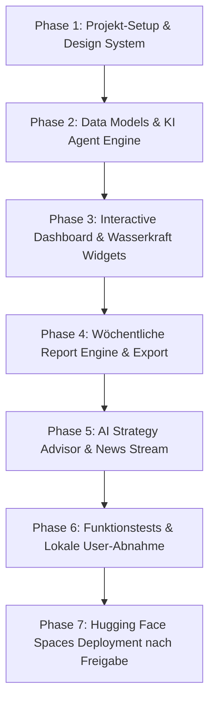

# Plan: Energy Trend Radar Austria & International Agent App

Eine moderne Web-App und KI-Agent zur Analyse aktueller Energie-Trends, mit Fokus auf Österreich, internationale Entwicklungen, Erneuerbare Energien (speziell Wasserkraft) sowie automatisierte wöchentliche Berichte und strategische Handlungsempfehlungen.

---

## 1. Übersicht & Zielsetzung

Der **Energy Trend Radar Agent** beobachtet kontinuierlich den Energiesektor mit Schwerpunkt auf:
- **Österreich**: E-Control, APG, Verbund, BMK, Erneuerbaren-Ausbau-Gesetz (EAG), Netzausbau.
- **Wasserkraft-Fokus**: Laufwasserkraft, Pumpspeicher-Kapazitäten, Pegelstände, Effizienzsteigerungen und Umweltauflagen.
- **International**: EU-Regulierungen (RED III), Strombörsen-Trends, Wasserstoff-Entwicklungen.
- **Wöchentliche Berichte**: Automatisierte Erstellung von detaillierten Markt-Reports mit PDF/Markdown-Export.
- **Strategische Tipps**: KI-generierte Handlungsempfehlungen für Entscheidungsträger, Investoren und Energie-Experten.

---

## 2. System-Architektur & Hugging Face Space Kompatibilität

Die Architektur ist speziell für die Bereitstellung auf **Hugging Face Spaces (Docker SDK)** optimiert:

| Komponente | Technologie | Beschreibung |
| :--- | :--- | :--- |
| **Frontend & Server** | Next.js 14 (App Router, TS) | Reaktives, modernes Fullstack Dashboard |
| **Styling** | Custom CSS (Hydro Dark Mode) | Glassmorphism, tiefblaue/smaragdgrüne Farbtöne, dynamische Animationen |
| **Agent / AI Engine** | Google Gemini API Integration | KI-Recherche, Trend-Synthese, wöchentliche Berichte, Strategie-Chatbot |
| **Visualisierung** | Recharts & SVG Widgets | Wasserkraft-KPIs, Erneuerbaren-Mix, Preisentwicklungen |
| **Export Engine** | HTML-to-PDF & Markdown | Ein-Klick Export von wöchentlichen Reports |
| **HF Space Deployment** | Docker SDK (Port 7860) | Custom `Dockerfile` (Multi-stage Node.js build) für HF Space hosting |

---

## 3. Features der App

### Dashboard & Trend Radar
- Live-Metriken zu Erneuerbaren in Österreich (% Wasserkraft, PV, Wind).
- Interaktive Trend-Cards mit Relevanz-Scores und Quellenangaben.
- Wasserkraft-Spezialbereich (Laufkraft vs. Speicher, Pumpspeicher-Status).

### Wöchentlicher Report Generator & Archiv
- KI-gestützte Erstellung strukturierter Wochenberichte.
- Gliederung: Executive Summary, Österreich-Focus, International, Wasserkraft-Deep-Dive, Strategische Empfehlungen.
- Historisches Archiv vergangener Berichte.
- PDF & Markdown Download.

### AI Strategy Advisor (Chatbot)
- Interaktiver KI-Assistent für strategische Unternehmens- und Marktfragen.
- Vordefinierte Schnellfragen ("Welche Trends betreffen Wasserkraft in Österreich?", "Welche Förderstrategien sind aktuell?").

### News Signal Stream
- Nachrichten-Aggregator sortiert nach Datum, Region (AT / EU / Int) und Sparte (Wasserkraft, Solar, Wind, Wasserstoff, Markt).

---

## 4. Schritt-für-Schritt Umsetzungsplan (Roadmap)

### Phase 1: Projekt-Setup & Design System
- Initialisierung von Next.js (TypeScript) im Projektverzeichnis.
- Erstellung des Hydro Energy CSS Themes (`globals.css`) mit Farbvariablen, Glassmorphism-Karten und Responsive Utilities.
- Erstellung des `Dockerfile` für Hugging Face Spaces (Port 7860).
- Aufbau der App-Shell (Navigation, Sidebar, Header, Mobile Drawer).

### Phase 2: Data Models & KI Agent Engine
- Definition der Datenstrukturen (`TrendItem`, `WeeklyReport`, `HydroMetric`, `StrategyTip`).
- Integration der KI-Agent-Logik zur Trend-Synthese und wöchentlichen Berichtserstellung.
- Einrichtung von Mock- & Live-Datenquellen für Österreich & Wasserkraft.

### Phase 3: Interactive Dashboard UI
- Entwicklung der KPI-Karten (Wasserkraft-Erzeugung, Erneuerbaren-Quote AT, Strompreis Index).
- Integration interaktiver Charts (Erzeugung nach Quelle, Pumpspeicher-Füllstände).
- Wasserkraft-Special Widget (Hydro Power Radar).

### Phase 4: Report-Engine & Export
- Erstellung des Report-Generators ("Neuen Bericht generieren").
- Strukturierte Darstellung von Wochenberichten mit Filtern.
- Export-Funktion für PDF & Markdown.

### Phase 5: AI Strategy Advisor & News Stream
- Interaktiver AI Strategy Advisor Chat mit Antworten auf Fragen zur Energiestrategie.
- News-Aggregator Feed mit Quellennachweisen.

### Phase 6: Ausführliche Funktionstests & Lokale Abnahme
- Build & Type Check (`npm run build`).
- Interaktiver Funktionstest aller App-Bereiche (Report-Erstellung, Chatbot, Export, UI Responsiveness).
- Lokale Präsentation und Abnahme durch den User.

### Phase 7: Hugging Face Spaces Veröffentlichung (Nach Freigabe)
- Deployment des Repositories / Docker Containers auf Hugging Face Spaces.

---

## 5. Vorgehens-Checkliste

- [x] **Phase 1: Foundation Setup**
  - [x] Next.js + TypeScript Projekt initialisieren (`package.json`, `tsconfig.json`, App Router)
  - [x] CSS & Hydro Energy Dark Mode Theme einrichten (`globals.css`, Variable-Tokens, Glassmorphism Cards)
  - [x] Hauptnavigation & App-Layout erstellen (`Navbar`, `Sidebar`, `Footer`)
  - [x] Hugging Face `Dockerfile` & HF Space Config anlegen (`Dockerfile`, `.dockerignore`)

- [x] **Phase 2: Data Models & KI Agent Engine**
  - [x] Datenmodelle definieren (`TrendItem`, `WeeklyReport`, `HydroMetric`, `StrategyTip`)
  - [x] AI Agent Service für Trend-Synthese & wöchentliche Report-Generierung implementieren
  - [x] Mock- & Live-Datenquellen für Österreich (E-Control/APG/Verbund) & Wasserkraft einbinden

- [x] **Phase 3: Interactive Dashboard UI**
  - [x] KPI Summary Header (Wasserkraft-Erzeugung, Erneuerbaren-Quote AT, Strompreis Index)
  - [x] Interactive Charts (Recharts Wasserkraft Erzeugung vs. Verbrauch)
  - [x] Hydro-Power Deep-Dive Component (Laufkraftwerke vs. Pumpspeicher & Modernisierung)
  - [x] Dynamic Trend Radar Cards mit Filterfunktionen (Österreich / Int / Erneuerbare)

- [x] **Phase 4: Weekly Report Engine & Export**
  - [x] Wöchentlicher KI-Bericht Generator ("Neuen Report generieren")
  - [x] Report-Detailansicht (Österreich, International, Wasserkraft, Strategie-Tipps)
  - [x] PDF & Markdown Export-Funktionalität

- [x] **Phase 5: AI Strategy Advisor & Live Feed**
  - [x] Interaktiver Chatbot ("Frag den Energy-Agenten") mit vordefinierten Fragen & KI-Antworten
  - [x] Live News Feed mit Filtern & Quellenangaben (APG, E-Control, EU Commission, Hydro Review)

- [x] **Phase 6: Function Tests & Local User Abnahme**
  - [x] Full Build & Type-Check (`npm run build`)
  - [x] Interaktiver Funktionstest aller App-Bereiche
  - [x] **Lokale Abnahme durch den User** (Bereit unter http://localhost:7860)

- [ ] **Phase 7: Hugging Face Spaces Release**
  - [ ] Deployment auf Hugging Face Spaces via Docker SDK (Port 7860) nach User-Freigabe
